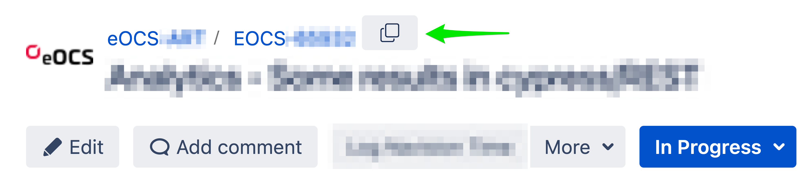

# eOCS Copy Jira Issue ID

A Google Chrome extension that allows you to copy the Jira Issue ID to the clipboard with a single click.

This is utilized for the development of the **eurofunk Operations Center Suite (eOCS)**. 👨‍💻

## Installation

1. Download the source code.
2. Open Chrome extension manager.
3. Load unpacked.